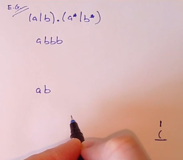
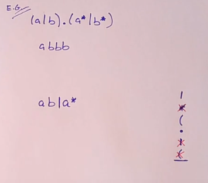
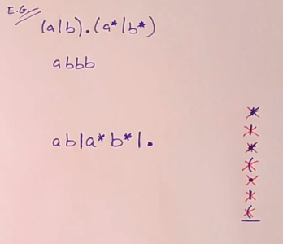
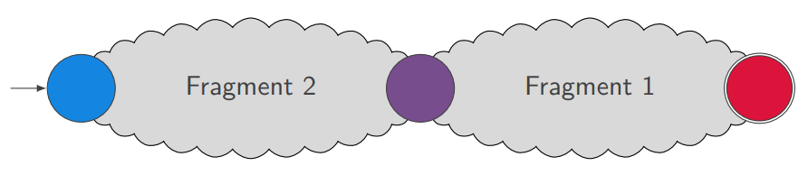
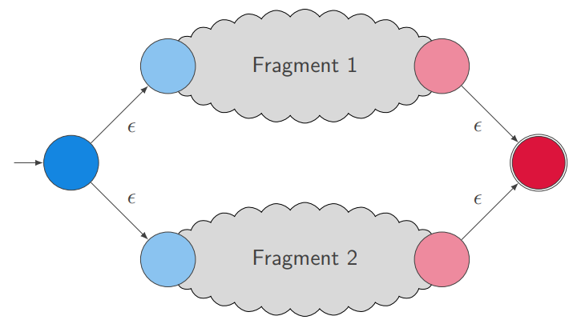
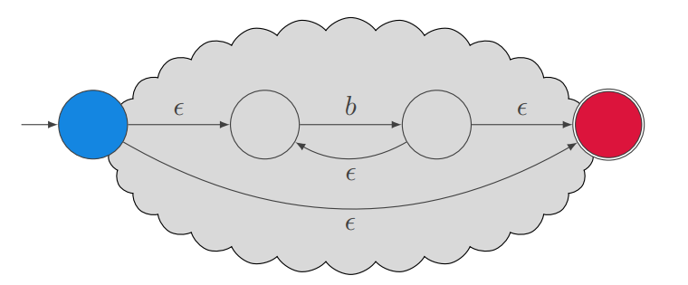

# <div align="center">Project Overview - Graph Theory
# <div align="center">Conor Shortt
</br>
</br>

## Introduction:
This repository contains my project for our graph theory module, semester two of year three. This project is a regular expression engine that was written in Python. And implements [Thompson's Construction Algorithm](https://en.wikipedia.org/wiki/Thompson%27s_construction) and the [Shunting Yard Algorithm](https://en.wikipedia.org/wiki/Shunting-yard_algorithm). </br>

The program takes in two strings from the user through command line arguments, the [regular expression](https://en.wikipedia.org/wiki/Regular_expression), and the string they wish to compare against the regular expression. The regular expression is then converted to a [Non - Deterministic Finite Automaton](https://en.wikipedia.org/wiki/Nondeterministic_finite_automaton) (NFA) using Thompson's Construction, and the string is then read into the NFA. If the NFA contains an accept state then the string is accepted by the NFA and the string matches the regular expression.</br>

Regular expressions contain characters that are used as operators, these operators are what the logic of the NFA's are built on. The operators that can be parsed and converted to NFA's are parentheses, dot operator which performs concatenation (*a.b* will accept the string *ab*), OR operator "|" ( *ab|ba* will accept strings *ab*, or *ba*), Kleene star operator * which accepts zero, one or many of the prefixed character, (a.b\* will accept the strings *ab*, *abbb*, *abbbbbb*, or even just *a*.), question mark operator ? which accept zero or one of the prefixed character (*a?b* will accept strings *ab*, or *b*), plus operator which accepts one or many of the prefixed character (*a.b+* will accepts strings *ab*, *abbbb*, etc). These are all the operators that are contained within the compiler. Below is some of the code behind the compiler:

```python
                if c == '.':
			# Pop two fragments(NFA'S) off the stack.
			frag1 = nfa_stack.pop()
			frag2 = nfa_stack.pop()
			# Point frag 2's accept state at frag 1's start state.
			frag2.accept.edges.append(frag1.start)

			start = frag2.start
			accept = frag1.accept
		elif c == '|':
			# Pop two frags off stack
			frag1 = nfa_stack.pop()
			frag2 = nfa_stack.pop()
			# Create new start and accept states
			accept = State()
			start = State(edges=[frag2.start, frag1.start])
			# Point the old accept states at the new one
			frag2.accept.edges.append(accept)
			frag1.accept.edges.append(accept)
```

These are just two of the operators that are in the compiler, look at *compiler.py* for the entire contents of my program's compiler.

## How to Run:
This program requires you to have Python 3 installed. Python is a widely used high-level programming language first launched in 1991. Since then, Python has been gaining popularity and is considered as one of the most popular and flexible server-side programming languages. So far it has been the easiest programming language for me to learn, as it handles a significant amount of little discrepancies that most programming languages require you to have. Curled brackets, semi-colons, etc.</br>

Python version 3.7.2 was the version lecturer Ian McGloughlin used for this project, so I followed suit. You can find this version of Python at [python.org](https://www.python.org/downloads/), navigate to specific downloads, this version was released on 24th of December 2018.

Download the installer and select <b>*Install Now*</b>, also select <b>*Install launcher for all users*</b> and <b>*Add Python 3.7 to PATH*</b>. This will allow you to run python scripts from CMD (windows command line).

Once Python is installed you can verify it by opening CMD and typing <b>*python --version*</b>.  If the python is installed successfully this command will print the python version you installed to the console. You must then clone my repository by typing *<b>git clone https://github.com/conorshortt123/graphtheory-project-repo.git</b>*. You must then navigate to the project folder by typing *<b>cd ./graphtheory-project-repo/Regex_Python_Scripts/</b>*.

Once in this directory you can run the program by typing *<b>python run.py -r "your regular expression here* -s "your string here"</b>. The program will then return the output "This regular expression matches the string", or "This regular expression does not match the string".

## Tests:
This program has built in tests to assert whether or not the program is working correctly. To run these tests go to the same directory as before, *<b>cd ./graphtheory-project-repo/Regex_Python_Scripts/</b>*. And again type *<b>python run.py --tests</b>*. The --tests argument will call the test function which contains the following code:
```python
def test():
    tests = [
        ["a.b|b*", "bbbbb", True],
        ["a.b|b*", "bbx", False],
        ["a.b", "abbbb", False],
        ["b**", "b", True],
        ["b*", "", True],
        ["b+", "bbbb", True],
        ["a.b", "ab", True],
        ["a?", "a", True],
        ["a?", "aaa", False]
    ]

    for test in tests:
        assert regex.match(test[0], test[1]) == test[2], test[0] + \
        (" should match " if test[2] else " should not match ") + test[1]
```

These tests run the program with multiple different inputs to test each operator that is allowed by the NFA compiler. If the program returns the expected Boolean for each test then there will be no output. But if the test returns the wrong output then errors will be displayed. 

## Algorithms:


This program utilizes two algorithms as highlighted in the introduction, but that I will detail now. [Thompson's Construction Algorithm](https://en.wikipedia.org/wiki/Thompson%27s_construction) and the [Shunting Yard Algorithm](https://en.wikipedia.org/wiki/Shunting-yard_algorithm) are two algorithms that are essential in constructing NFA's.
### Shunting Yard Algorithm:
The shunting yard algorithm takes the regular expression string that the user inputs,
this string is written in [infix notation](https://en.wikipedia.org/wiki/Infix_notation) which involves placing operators between operands. Infix notation is easier to read and write for humans. This infix notation is then parsed by the shunting yard algorithm which compiles it into postfix notation. [Postfix notation](https://en.wikipedia.org/wiki/Reverse_Polish_notation) is a mathematical notation in which operators follow their operands. For example infix notation (a+b*) would be converted to postfix notation ab*+.

<b>*Figure 1: Conversion of infix to postfix.*</b></br>


As we can see in figure 1 above, the infix string <b>(a|b).(a*|b*)</b>. This infix notation is converted to postfix using the following steps:

* Remove the opening bracket and add it to the stack.
* Remove any operators after this and add them to the stack.
* Upon encountering a closing bracket, pop any operators off the stack onto the postfix string, and discard brackets.

<b>*Figure 2: Popping operators of greater precedence off the stack.*</b></br>


* If you are pushing an operator to the stack that has a lower precedence than the operator on top of the stack, you *must* first *pop* the operator on top of the stack off, and add it to the postfix string, and *then* push the operator to the top of the stack. *See figure 2 above.*
* Precedence of operators is (* + ? . |) from left to right, Kleene star has greatest precedence, then plus, question mark, concatenate, and finally OR operator.


<b>*Figure 3: Finding the closed bracket and popping all operators off the stack.*</b></br>


* As you can see in figure 3 above the infix has been completely shunted into postfix, and all of the operators are in the correct precedence.

<b>Some of the shunting yard algorithm code is as follows:</b>

```python
# Operator precedence.
    prec = {'*': 100, '?': 95, '+': 90, '.': 80, '|': 60, ')': 40, '(': 20}

    # Loop through the input one character at a time.
    while infix:
        # Pop a character from the input.
        c = infix.pop()

        # Decide what to do based on the character.
        if c == '(':
            # Push an open bracket to the opers stack.
            opers.append(c)
        elif c == ')':
            # Pop the operators stack until you find an (.
            while opers[-1] != '(':
                postfix.append(opers.pop())
            # Get rid of the '('.
            opers.pop()
        elif c in prec:
            # Push any operators on the opers stack with higher prec to the output.
            while opers and prec[c] < prec[opers[-1]]:
                postfix.append(opers.pop())
            # Push c to the operator stack.
            opers.append(c)
        else:
            # Typically, we just push the character to the output.
            postfix.append(c)

    # Pop all the operators to the output.
    while opers:
        postfix.append(opers.pop())

    # Convert output list to string.
    return ''.join(postfix)
```

### Thompson's Construction Algorithm:

Thompson's construction algorithm is a way of converting a regular expression into equivalent non-deterministic finite automaton. NFA's are used to match strings against regular expressions. This algorithm is credited to Ken Thompson but can also be called the McNaughton-Yamada-Thompson algorithm.

Regex and NFA's are two representations of formal languages. (A formal language in computer science consists of words whose letters are taken from an alphabet and are well formed according to a specific set of rules.) Text processors use regular expressions to describe advanced search patterns, NFA's are better suited for execution using a computer, therefore Thompson's algorithm has a practical interest in relation to executing regular expressions.

### Example Diagrams of NFA's

<b>*Figure 4: Example of an NFA using the concatenation operator "."*</b></br>


This NFA is an example of the concatenation operator. The concatenation operator combines two NFA fragments with one another to form a single NFA. This is achieved by changing where the states point to, so the new fragment contains the starting state (blue) and points at the start state of the old fragment (purple). The accept state remains the same (red).

<b>*Figure 4: Example of an NFA using the OR/Union operator "|"*.</b></br>


This NFA is again a combination of two fragments. Fragment two is added, and two new states are created. A starting state (blue) is added, and a new accept state (red). The new starting state points to both fragments, and both fragments point to the accept state.

<b>*Figure 5: Example of an NFA using the Kleene star operator "\*"*.</b></br>


This NFA is an example of the Kleene star operator. The old fragment (blue -> red) is expanded upon by adding two new states inside. The e(psilon) operators are followed instantly, so this fragment will actually be in the accept state instantly, regardless of any inputs, but it will also accept a single or multiple b's as input.

<b>Some of the Thompson's construction algorithm code is as follows:</b>

```python
if c == '.':
			# Pop two fragments(NFA'S) off the stack.
			frag1 = nfa_stack.pop()
			frag2 = nfa_stack.pop()
			# Point frag 2's accept state at frag 1's start state.
			frag2.accept.edges.append(frag1.start)

			start = frag2.start
			accept = frag1.accept
		elif c == '|':
			# Pop two frags off stack
			frag1 = nfa_stack.pop()
			frag2 = nfa_stack.pop()
			# Create new start and accept states
			accept = State()
			start = State(edges=[frag2.start, frag1.start])
			# Point the old accept states at the new one
			frag2.accept.edges.append(accept)
			frag1.accept.edges.append(accept)
		elif c == '*':
			# Pop a single fragment off the stack
			frag = nfa_stack.pop()
			# Create new start and accept states
			accept = State()
			start = State(edges=[frag.start, accept])
			# Point the arrows.
			frag.accept.edges = (frag.start, accept)
		elif c == '?':
			# Pop a single fragment off the stack
			frag = nfa_stack.pop()
			# Create new start and accept states
			accept = State()
			start = State(edges=[frag.start, accept])
			# Point the old accept states at the new one
			frag.accept.edges.append(accept)
		elif c == '+':
			# Pop a single fragment off the stack
			frag = nfa_stack.pop()
			# Create new start and accept states
			accept = State()
			start = State(edges=[frag.start])
			# Point the old accept states at the new one
			frag.accept.edges = (frag.start, accept)
		else:
			accept = State()
			start = State(label=c, edges=[accept])

		# Create new instance of Fragment to represent the new NFA
		newfrag = Fragment(start, accept)
		# Push new NFA to stack.
		nfa_stack.append(newfrag)
```

**This code reads in the postfix regular expression and converts it to an NFA.**

# References
**Thompson's Construction Algorithm**

Used to make Non-Deterministic Finite Automata.

><https://en.wikipedia.org/wiki/Thompson%27s_construction>

**Shunting Yard Algorithm**

Used to convert infix notation to postfix notation.

><https://en.wikipedia.org/wiki/Shunting-yard_algorithm>

**Ian McGloughlin - GMIT Lecturer**

Lecturer of the Graph Theory module. His videos are very easy to follow and highly informative.

><https://github.com/ianmcloughlin>

><https://learnonline.gmit.ie/course/view.php?id=1599>

**Finite State Machine Designer**

Really helpful resource that lets you design NFA's quickly and efficiently. These designs can be exported easily to SVG's, PNG's etc.

><http://madebyevan.com/fsm/>

**Python Language**

The language used to create this program. Very intuitive language and the easiest language for me to learn so far.

><https://www.python.org/downloads/>

**PEP 8 Style Guide**

One of the guides for the python language. Helped significantly when formatting code and writing docstrings.

><https://www.python.org/dev/peps/pep-0008/>

**MIT - Regular Expression Operators**

Helpful guide to regular expression operators and what each operator does.

><http://web.mit.edu/gnu/doc/html/regex_3.html>
